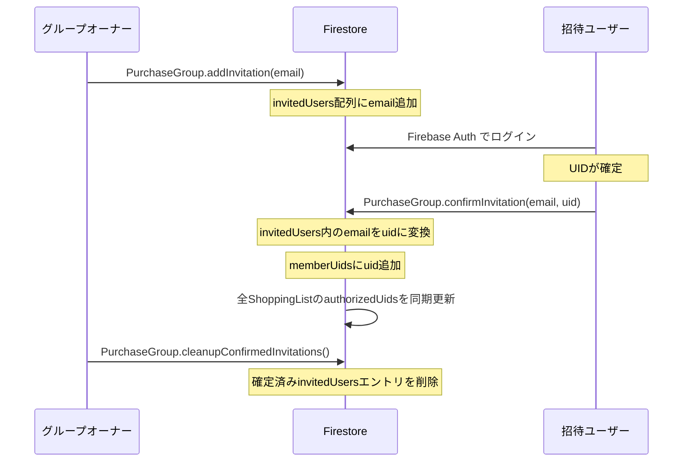
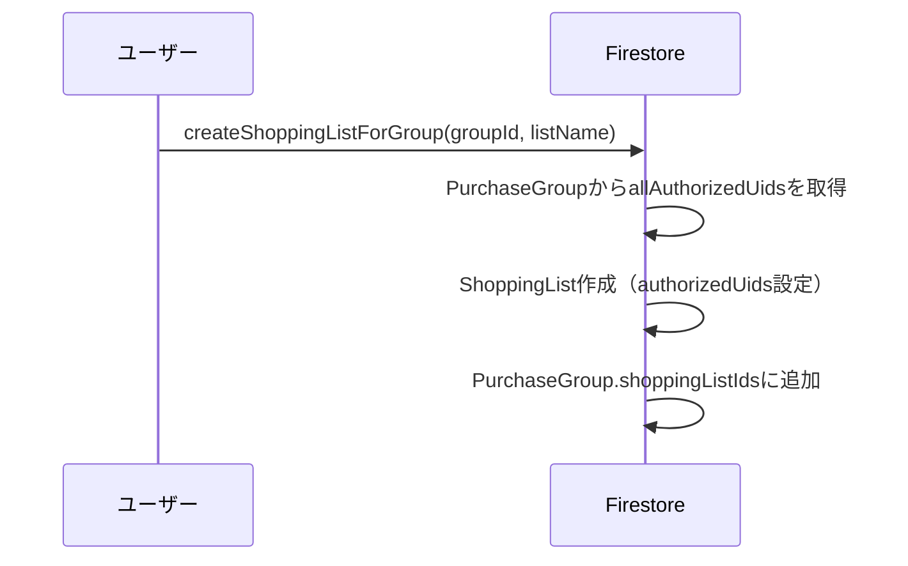
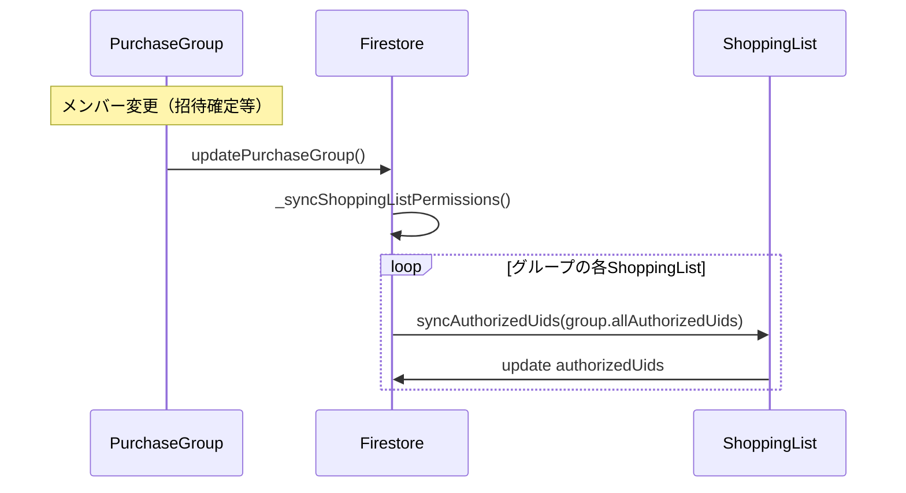

# Firestore アーキテクチャ仕様書

## 概要
グループベースの買い物リスト管理システムにおいて、招待管理とアクセス制御を効率的に行うためのFirestore設計。

## データ構造

### 1. PurchaseGroup（購入グループ）
**コレクション**: `/purchaseGroups/{groupId}`

```typescript
{
  groupName: string;           // グループ名
  ownerUid: string;           // オーナーのUID
  ownerEmail: string;         // オーナーのメールアドレス
  memberUids: string[];       // 確定メンバーのUID一覧
  invitedUsers: {             // 招待中ユーザー一覧（メール→UID変換管理）
    email: string;
    uid?: string;             // ログイン後に設定
    invitedAt: string;        // ISO8601 日時
    isConfirmed: boolean;     // UID確定フラグ
    role: string;             // 招待時の役割
  }[];
  shoppingListIds: string[];  // このグループが持つShoppingListのID一覧
  metadata: object;           // その他のメタデータ
  updatedAt: Timestamp;       // サーバータイムスタンプ
}
```

**責務**:
- 招待管理の中心（メールアドレス↔UID対応）
- グループメンバーシップの管理
- 複数のShoppingListとの関連付け

### 2. ShoppingList（買い物リスト）
**コレクション**: `/shoppingLists/{listId}`

```typescript
{
  ownerUid: string;            // リスト作成者のUID
  groupId: string;             // 所属PurchaseGroupのID
  listName: string;            // リスト名
  items: {                     // 買い物アイテム
    memberId: string;
    name: string;
    quantity: number;
    registeredDate: string;
    purchaseDate?: string;
    isPurchased: boolean;
    shoppingInterval: number;
    deadline?: string;
  }[];
  authorizedUids: string[];    // アクセス権限を持つUID一覧（グループから同期）
  metadata: object;            // その他のメタデータ
  updatedAt: Timestamp;        // サーバータイムスタンプ
}
```

**責務**:
- 買い物アイテムの管理
- シンプルなUID権限チェック
- グループから権限を同期取得

## データフロー

### 1. 招待〜参加プロセス



### 2. ShoppingList作成プロセス



### 3. 権限同期プロセス



## セキュリティルール

### PurchaseGroup
```javascript
match /purchaseGroups/{groupId} {
  allow read, write: if request.auth != null && (
    // オーナーまたはメンバー
    resource.data.ownerUid == request.auth.uid ||
    request.auth.uid in resource.data.memberUids ||
    // 招待されたメールアドレスを持つユーザー（確認前）
    request.auth.token.email in resource.data.invitedUsers.map(['email'])
  );
}
```

### ShoppingList
```javascript
match /shoppingLists/{listId} {
  allow read, write: if request.auth != null && (
    // オーナーまたは権限を持つユーザー
    resource.data.ownerUid == request.auth.uid ||
    request.auth.uid in resource.data.authorizedUids
  );
}
```

## 実装クラス

### 1. モデルクラス
- `FirestorePurchaseGroup`: 招待管理とメンバー管理
- `GroupInvitedUser`: 招待ユーザー情報
- `FirestoreShoppingList`: シンプルな買い物リスト

### 2. リポジトリクラス
- `FirestorePurchaseGroupRepository`: 
  - グループCRUD操作
  - 招待管理機能
  - ShoppingList作成と権限同期
- `FirestoreShoppingListRepository`: 
  - リストCRUD操作
  - アイテム管理

### 3. プロバイダー
- `watchPurchaseGroupProvider`: グループのリアルタイム監視
- `watchUserPurchaseGroupsProvider`: ユーザーのグループ一覧監視
- `watchGroupShoppingListsProvider`: グループのリスト一覧監視

## メリット

### 1. 責務の分離
- **PurchaseGroup**: 招待管理とメンバーシップ
- **ShoppingList**: 買い物データとシンプルな権限

### 2. 効率的な権限管理
- 招待〜確定プロセスが一元化
- 自動的な権限同期
- メールアドレス情報の適切な削除

### 3. スケーラビリティ
- 1つのグループが複数のShoppingListを持てる
- 権限変更時の一括同期
- 将来的な機能拡張に対応

### 4. セキュリティ
- Firestore Security Rulesでの確実なアクセス制御
- 招待前・確定前・確定後の段階的権限管理
- メールアドレス漏洩リスクの最小化

## 運用フロー

### グループ作成
1. `createPurchaseGroup()` でグループ作成
2. `createShoppingListForGroup()` でデフォルトリスト作成

### メンバー招待
1. `addInvitation()` でメールアドレス招待
2. 招待ユーザーがログイン
3. `confirmInvitation()` でUID確定・権限付与
4. `cleanupConfirmedInvitations()` でメールアドレス削除

### 権限管理
- グループメンバー変更時に自動でShoppingList権限同期
- セキュリティルールで確実なアクセス制御
- リアルタイム監視でUI即座反映